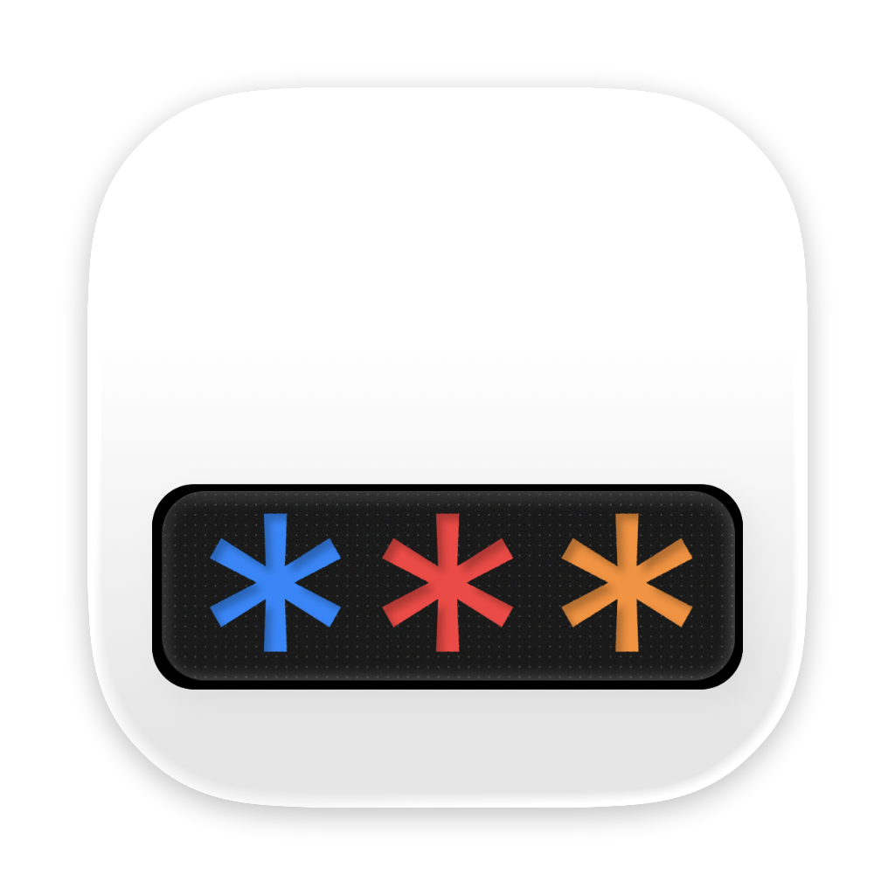

# Glyph

<p align="center">
  
</p>

<p align="center">
  <strong>Join the Glyph community</strong><br />
  Share feedback, ask questions, and help shape what comes next.
</p>

<p align="center">
  <a href="https://discord.gg/fasY8gAQR"><strong>Join us on Discord →</strong></a>
</p>


Glyph is a local-first desktop space for notes, collections, previews, and AI-assisted thinking. Your notes are plain Markdown files stored in a folder you choose, making them accessible to any app that understands Markdown.

---

## macOS Setup & Build Guide

This guide will walk you through setting up your macOS environment to compile and run Glyph from source.

### 1. Install System Dependencies

Open your terminal and follow these steps:

#### **Homebrew**
If you don't have Homebrew installed, install it first:
```bash
/bin/bash -c "$(curl -fsSL https://raw.githubusercontent.com/Homebrew/install/HEAD/install.sh)"
```

#### **Xcode Command Line Tools**
Required for native compilation:
```bash
xcode-select --install
```

#### **Node.js (v20 or higher)**
We recommend using `fnm` or `nvm` to manage Node versions, or install directly via Homebrew:
```bash
brew install node
```

#### **Rust**
Install the Rust toolchain via `rustup`:
```bash
curl --proto '=https' --tlsv1.2 -sSf https://sh.rustup.rs | sh
```
*Restart your terminal after installation.*

#### **pnpm**
Glyph uses `pnpm` for package management:
```bash
corepack enable
corepack prepare pnpm@10.28.2 --activate
```

### 2. Clone and Install Dependencies

```bash
# Clone the repository
git clone https://github.com/your-username/glyph.git
cd glyph

# Install frontend dependencies
pnpm install
```

### 3. Running the App

You have two main ways to run Glyph during development:

#### **A. Full Tauri App (Recommended)**
This compiles the Rust backend and launches the Vite frontend together in a native macOS window.
```bash
pnpm tauri dev
```

#### **B. Frontend Only (Fast UI Iteration)**
Runs the React frontend in your browser at `http://localhost:1420`. Note: Backend-specific features like file system access will not work in this mode.
```bash
pnpm dev
```

### 4. Compiling for Production

To create a production build (`.app` or `.dmg`):

```bash
pnpm build
```
This command runs `tsc`, builds the Vite frontend, and then triggers the Tauri bundler. The final application will be located in `src-tauri/target/release/bundle/`.

---

## Development Commands

| Task | Command |
| :--- | :--- |
| **Lint & Format** | `pnpm check` (check) / `pnpm format` (fix) |
| **Tests (Vitest)** | `pnpm test` |
| **Rust Check** | `cd src-tauri && cargo check` |
| **Rust Lint** | `cd src-tauri && cargo clippy` |

## Key Dependencies

**Frontend:** React 19, TipTap 3, Tailwind 4, Radix UI, Motion 12, TanStack Table.
**Backend:** Tauri 2, rig-core, rusqlite, tokio, window-vibrancy.

## Conventions

- **TypeScript:** Strict mode. No `any` — use `unknown`.
- **State Management:** Functional React components + Context.
- **IPC:** All Tauri IPC through `invoke()` in `src/lib/tauri.ts`.
- **Rust:** Atomic writes via `io_atomic`, safe paths via `paths::join_under()`.

---

*Note: macOS is the primary and currently only supported target for Glyph.*
