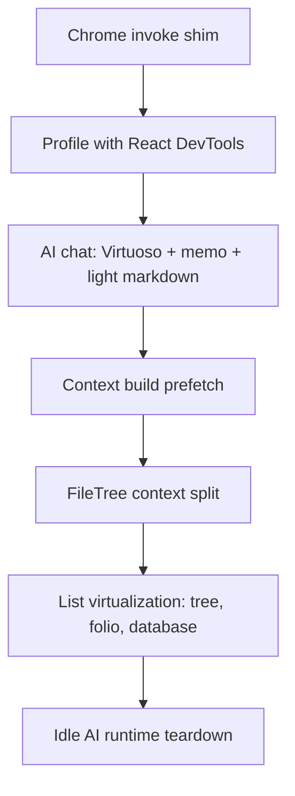

# Performance Report: Conductor vs Glyph

Based on the [Conductor rewrite article](https://performance.dev/the-conductor-rewrite) and a pass through Glyph’s architecture (`docs/architecture/`, `src/contexts/`, `src/components/ai/`, `src/components/filetree/`, etc.), there **are** meaningful improvements available. Glyph already shares Conductor’s strongest foundation (local-first + Tauri). The biggest gaps are in **React rendering discipline** — especially the AI chat — and in **measurement tooling**.

---

## Executive Summary

| Area | Conductor | Glyph | Gap severity |
|------|-----------|-------|--------------|
| Local-first storage | SQLite as source of truth | Files + `.glyph/glyph.sqlite` index | Low — both strong |
| Native shell | Tauri 2.6 | Tauri 2 | Low |
| Data fetching | TanStack Query + Zustand | TanStack Query + React Context | Medium |
| Navigation / stable refs | TanStack Router (structural sharing) | Custom tab manager (no URL router) | Medium (different failure mode) |
| Chat rendering | `react-virtuoso` + `React.memo` | `messages.map()` + TipTap per message | **High** |
| List virtualization | Virtuoso + react-virtual | None | **High** |
| Profiling in Tauri | Chrome `invoke()` shim | Direct Tauri only | **High** (for engineering) |
| Agent process memory | Idle kill + `--resume` | Long-lived Codex/CLI processes | Medium |
| First-token latency | Checkpoint moved off critical path | `ai_context_build` awaited before send | Medium |
| Prefetch / lazy load | Per-package chunks | Strong prefetch + lazy panes | Low — Glyph is good here |

**Bottom line:** Glyph is not slow because it picked the wrong platform. It is positioned to be fast, but Conductor’s rewrite targeted exactly the surfaces where Glyph still has the “simple React” patterns — unvirtualized lists, full-tree re-renders on streaming updates, and heavy per-row renderers.

---

## Part 1: What Conductor Did (and Why It Worked)

### 1. Local-first eliminates the network ceiling

Conductor stores everything in local SQLite. No remote DB, no sync wait. The UI never blocks on network I/O.

**Glyph equivalent:** Same philosophy. Notes live as files; derived metadata lives in `.glyph/glyph.sqlite`. The frontend never touches the filesystem directly — everything goes through typed `invoke()` in `src/lib/tauri.ts`. This is architecturally sound and matches Conductor’s strongest bet.

### 2. Tauri as the native shell

Smaller bundle, faster cold start, native WebKit rendering. Tradeoff: Safari Web Inspector cannot run React DevTools Profiler.

**Glyph:** Same stack. Same tradeoff. You inherit the profiling blind spot unless you build around it.

### 3. Measurement first — the Chrome `invoke()` shim

Conductor’s breakthrough was not a library — it was **seeing** the problem:

```typescript
// Conductor pattern: boot the same Vite client in Chrome with a shimmed invoke()
if ("__TAURI_INTERNALS__" in window) return tauriInvoke(cmd, args);
return fetch(`/__backend__/${cmd}`, { method: "POST", body: JSON.stringify(args) }).then(r => r.json());
```

That unlocked React DevTools Profiler in Chrome and showed re-renders were the bottleneck, not SQLite or IPC.

**Glyph today:** `invoke()` in `src/lib/tauri.ts` goes straight to Tauri with no browser shim:

```1137:1147:src/lib/tauri.ts
export async function invoke<K extends keyof TauriCommands>(
	command: K,
	...args: ArgsTuple<K>
): Promise<TauriCommands[K]["result"]> {
	try {
		const payload = args.length > 0 ? asInvokePayload(args[0]) : {};
		return (await tauriInvoke(command, payload)) as TauriCommands[K]["result"];
	} catch (raw) {
		throw new TauriInvokeError(errorMessage(raw), raw);
	}
}
```

Without this, performance work in Glyph is largely guesswork inside WKWebView.

### 4. TanStack Router — stable references, not `useMemo` everywhere

Conductor’s 50% win on tab/workspace switching came from replacing `react-router` (unstable `URLSearchParams` / object refs on every navigation) with TanStack Router’s structural sharing.

**Glyph:** No `react-router` at all. Navigation is tab-based via `useTabManager` + context state. That avoids Conductor’s specific bug, but introduces a different cascade:

On every tab switch, `syncWorkspaceState` updates **three** stores at once:

```68:94:src/components/app/useTabManager.ts
const syncWorkspaceState = useCallback(
	(nextTabs, nextActiveTabId, previousActiveTarget) => {
		// ...
		setActiveFilePath(nextFilePath);
		setOpenMarkdownTabs(nextMarkdownTabs);
		setActiveMarkdownTabPath(nextActiveMarkdownPath);
		// ...
	},
```

`setActiveFilePath` lives in `FileTreeContext`; tab state lives in `UIContext`. Any consumer of `useFileTreeContext()` — including `AppShell` — can re-render on tab changes even when the sidebar file tree did not meaningfully change.

### 5. Chat: virtualization + memoization

Conductor’s core fix for chat:

1. **Virtualize** with `react-virtuoso` (`VirtuosoMessageList`) — ~15 DOM nodes instead of 500
2. **`React.memo` per message** — streaming only re-renders the active message
3. Lighter markdown pipeline (`react-markdown` + Shiki), not a full editor per row

**Glyph today — the highest-impact gap:**

```150:167:src/components/ai/AIChatThread.tsx
{messages.map((msg, index) => {
	const text = messageText(msg).trim();
	// ...
	return (
		<Fragment key={msg.id}>
			<div className={cn("aiChatMsg", ...)}>
```

No `React.memo`. No virtualization. Every streaming token triggers a full thread reconcile.

Worse: each assistant message mounts a **full TipTap editor**:

```42:53:src/components/ai/AIMessageMarkdown.tsx
export function AIMessageMarkdown({ markdown }: AIMessageMarkdownProps) {
	// ...
	const editor = useEditor({
		editable: false,
		extensions: MARKDOWN_VIEW_EXTENSIONS,
		content: markdown,
		contentType: "markdown",
```

And on every token during streaming:

```179:193:src/components/ai/hooks/useRigChat.ts
updateMessages((prev) =>
	prev.map((m) => {
		if (m.id !== assistantId) return m;
		return {
			...m,
			parts: [{ type: "text", text: `${first?.text ?? ""}${payload.delta}` }],
		};
	}),
);
```

That creates a new messages array → re-renders `AIChatThread` → re-runs `setContent` on the streaming TipTap instance → re-parses markdown → re-processes code blocks. For a 30-message thread, this is orders of magnitude heavier than Conductor’s Virtuoso + memo approach.

`AIChatThread` is also not memoized and has no `useMemo`/`useCallback` at all.

### 6. Agent process memory management

Conductor kills idle agent processes and resumes via `--resume <uuid>`. Ten idle workspaces do not mean ten live processes.

**Glyph:** External provider runtimes (Codex, Claude Code, OpenCode, Pi) spawn and keep child processes. `CodexState` holds a long-lived `RuntimeProcess` in a mutex — no idle teardown pattern like Conductor’s. For users running multiple AI providers or long sessions, memory pressure is real.

### 7. First-token latency — move work off the critical path

Conductor moved `git add -A` checkpointing to the background so the model could start immediately.

**Glyph’s equivalent bottleneck:** context assembly before send:

```110:136:src/components/ai/AIPanel.tsx
const built = await context.ensurePayload();
// ...
void chat.sendMessage({ text: sanitized }, {
	body: {
		// ...
		context: built.payload || undefined,
		context_manifest: built.manifest ?? undefined,
		audit: true,
	},
});
```

`ensurePayload()` calls `ai_context_build` in Rust (file reads, truncation, manifest assembly) **before** `ai_chat_start`. With several `@` attachments or large folders, that delay sits between Enter and the first token.

The good news: `ai_chat_start` itself returns quickly and streams via events — audit logging and title generation happen after completion, not before first token. The context build is the main frontend-side blocker.

---

## Part 2: Glyph’s Software Profile (Current Stack)

| Layer | Glyph choice |
|-------|-------------|
| UI | React 19, TypeScript, Vite 7, Tailwind 4 |
| Native | Tauri 2 + Rust |
| Editor | TipTap 3 + ProseMirror (notes **and** AI messages) |
| State | React Context (`Space`, `FileTree`, `UI` split into layout + AI, `Editor`) + `useReducer` in UI |
| Server state | TanStack Query (AI profiles, history, tasks, folio, calendar, etc.) |
| Routing | None — tab manager + context, not URL-based |
| Virtualization | **None** (`react-virtuoso`, `react-virtual` not in `package.json`) |
| Motion | Motion (spring animations on AI panel, tool timeline, shell transitions) |
| Storage | Markdown files + `.glyph/glyph.sqlite` (FTS, tags, links, tasks) |
| AI | Rig multi-provider + Codex/Claude Code/OpenCode/Pi subprocess runtimes |
| Profiling | No browser shim |

### What Glyph already does well (Conductor-aligned)

1. **Single active editor** — `MainContent` renders one `NotePane` for the active tab, not all tabs at once
2. **Lazy heavy panes** — Databases, Calendar, Tasks, AI panel are code-split
3. **Prefetch system** — `navigationPrefetch.ts` warms notes, calendar, database rows on hover/intent
4. **AI panel unmounts when closed** — `AIFloatingHost` tears down after exit animation
5. **Split UI context** — `UILayoutContext` vs `AISidebarContext` limits some AI re-render blast radius
6. **Some memoization** — `FileTreePane`, `MainContent`, `TabBar`, folio items use `memo`
7. **Streaming architecture** — Tauri events (`ai:chunk`, `ai:done`) with job buffering is solid
8. **Index is derived** — `index_rebuild` on space open is async and non-blocking for chat IPC

---

## Part 3: Significant Improvements for Glyph (Prioritized)

### Tier 1 — High impact, directly mirrors Conductor’s wins

#### 1. Rebuild AI chat rendering (biggest ROI)

**Target state (Conductor pattern):**

```
messages[]
  → VirtuosoMessageList (or Virtuoso for history panel)
  → ChatMessageRow wrapped in React.memo
  → Lightweight markdown for completed messages
  → TipTap or incremental plain-text only for the actively streaming message
```

**Concrete steps:**

- Add `react-virtuoso` (Conductor uses `VirtuosoMessageList` specifically for chat stick-to-bottom behavior)
- Extract `ChatMessageRow` as `memo()` with props `{ id, role, text, isStreaming }`
- Replace `AIMessageMarkdown` TipTap instances with `react-markdown` + `highlight.js` (you already depend on highlight.js) for **completed** messages
- During streaming: render plain text or a single lightweight incremental renderer; run full markdown parse once on `ai:done`
- Throttle streaming updates (e.g. `requestAnimationFrame` batching) so you do not call `setMessages` on every token

**Expected effect:** Smooth chat at 100+ messages with live streaming — the surface users stare at all day.

#### 2. Add the Chrome profiling shim

Port Conductor’s `invoke()` dual-path into `src/lib/tauri.ts` for dev builds. Stand up a minimal `/__backend__/` proxy (or mock fixtures per surface).

This is not a user-facing perf win — it is what makes Tier 1 and Tier 3 optimizations **provable** instead of speculative.

#### 3. Virtualize large lists

No virtualization exists anywhere in `src/`. Candidates:

| Surface | Risk |
|---------|------|
| `FileTreePane` recursive `TreeEntries` | Thousands of DOM nodes when dirs are expanded |
| `FolioNotesListPane` `visibleRegularNotes.map` | Large spaces with hundreds of notes |
| `DatabaseTable` `displayRows` | Full table render via TanStack Table |
| `CommandPalette` search results | FTS can return many hits |
| `AIHistoryPanel` | Grows with session count |

`@tanstack/react-virtual` works well for the file tree and database table; `react-virtuoso` is better for chat and folio note lists.

---

### Tier 2 — Medium impact, architectural

#### 4. Split `FileTreeContext` (Conductor’s “stable refs” equivalent)

`FileTreeContext` exposes ~25 fields in one value object. Any `activeFilePath`, `tags`, `expandedDirs`, or `itemAppearance` change recreates the context value and re-renders all consumers:

```510:571:src/contexts/FileTreeContext.tsx
const value = useMemo<FileTreeContextValue>(() => ({
	rootEntries,
	// ... 20+ more fields
}), [rootEntries, childrenByDir, expandedDirs, activeFilePath, tags, ...]);
```

`AppShell` calls `useFileTreeContext()` at the top level — so file tree churn propagates to the entire shell.

**Fix pattern:**

- Split into `FileTreeNavigationContext` (active paths) vs `FileTreeDataContext` (entries, tags)
- Or move high-churn state to Zustand with selectors (Conductor’s approach)
- Ensure `AppShell` subscribes only to what it needs

#### 5. Move `ai_context_build` off the send critical path

Conductor’s checkpoint pattern applied to Glyph:

- **Pre-build** context when attachments change (debounced), not on Send
- Show “Preparing context…” only if cache is stale
- On Send: use cached payload immediately, kick off `ai_chat_start`, refresh context in background if needed
- For large folder attachments: stream context assembly progressively or cap with clear UX

#### 6. Idle lifecycle for external AI runtimes

For Codex / Claude Code / OpenCode / Pi:

- Track last activity per runtime
- Tear down idle subprocesses after N minutes
- Resume via session UUID on next message (Conductor’s `--resume` pattern)

This matters for power users with multiple provider profiles open.

#### 7. Tame Motion in hot paths

`AIToolTimeline` uses `AnimatePresence` + spring layout animations on every tool/text event during streaming. That is expensive alongside chat re-renders. Consider:

- Disable layout animations during active streaming
- `useReducedMotion` gating (partially present elsewhere, not consistently in timeline)

---

### Tier 3 — Lower impact / polish

#### 8. Expand TanStack Query usage

Query is used well for AI settings, folio, tasks, calendar — but file tree state is still manual `useState` in context. Moving `tags_list`, `space_list_dir`, pinned files into query keys with structural sharing would reduce bespoke cache invalidation and align with Conductor’s data layer pattern.

#### 9. Tab switch batching

`syncWorkspaceState` fires three separate context updates. React 19 batching helps, but a single atomic “workspace navigation” update would reduce intermediate renders.

#### 10. Fuzzy search client-side

Conductor uses `fuzzysort` / `fuse.js` for command palette filtering. Glyph’s command palette filters in-memory commands but delegates note search to Rust FTS (good for large corpora). No change needed unless command-mode filtering feels sluggish with many custom commands.

---

## Part 4: What Not to Copy Blindly

| Conductor change | Glyph applicability |
|------------------|---------------------|
| TanStack Router | Low — you do not have URL routing; fix context cascades instead |
| Zustand everywhere | Optional — split contexts or selectors may be enough |
| Bun for agents | N/A — Glyph uses user-installed CLIs, not bundled Node/Bun agents |
| `react-markdown` + Shiki for code | High for AI chat; keep TipTap for the **editor** (correct tool there) |
| Checkpoint off critical path | Translate to `ai_context_build` prefetch, not git checkpoints |

---

## Part 5: Suggested Roadmap



**Phase 0 (1–2 days):** Dev profiling shim + baseline measurements on tab switch, chat streaming, large file tree  
**Phase 1 (3–5 days):** AI chat rewrite — highest user-visible win  
**Phase 2 (3–5 days):** Context prefetch + FileTree context split  
**Phase 3 (ongoing):** Virtualize lists as real-world large-space pain appears  

---

## Closing Assessment

Glyph and Conductor made the same **macro** bets: local-first, Tauri, modern React, TipTap for editing. Conductor’s rewrite was almost entirely **micro**: measure renders, fix unstable references, virtualize chat, lighten per-row work, and get heavy subprocess work off the hot path.

Glyph is ahead on some of those micro choices (single editor, prefetch, lazy AI panel, no react-router ref churn). It is behind on the ones that matter most for a note + AI app: **chat rendering** and **list virtualization**. The TipTap-per-message pattern in `AIMessageMarkdown` is likely the single most expensive architectural decision relative to Conductor’s model.

If you want to go deeper next, I can turn Phase 0 + Phase 1 into a concrete implementation plan with file-level diffs, or build the Chrome `invoke()` shim first so you have numbers before changing anything.


----


# TipTap / Editor: Conductor vs Glyph (code review)

The Conductor article barely touches the editor. It lists **TipTap + ProseMirror for the rich-text composer** and puts **read-only markdown** (`react-markdown`, `marked`/`remark`/`rehype`) and **Shiki** on separate surfaces. The rewrite focused on chat virtualization and routing — not on making the composer itself faster.

After reading Glyph’s editor stack, the picture is more nuanced: **the main note editor is a reasonable use of TipTap**, but **Glyph also uses TipTap where Conductor explicitly would not**, and there are several **per-keystroke costs** in the note editor that the article never had to solve.

---

## What Conductor does with TipTap (from the article)

| Surface | Conductor |
|---------|-----------|
| Chat composer | TipTap (single input) |
| Chat message history | `react-markdown` + remark/rehype — **not** TipTap |
| Code viewing | Shiki — **not** TipTap |
| File/code panes | Separate from the composer |

TipTap is scoped to **one editable surface**. Everything read-only or high-volume uses a lighter pipeline.

---

## What Glyph does with TipTap (from the code)

There are **three** TipTap surfaces:

| Surface | File | Role |
|---------|------|------|
| **Note editor** | `useNoteEditor.ts` → `NoteEditorSurface.tsx` | Primary writing surface — correct |
| **AI chat messages** | `AIMessageMarkdown.tsx` | Read-only markdown — **same engine as notes** |
| **AI composer** | `AIComposer.tsx` | `contentEditable` div — **no TipTap** (lighter than Conductor) |

So Glyph is **lighter than Conductor on the composer** and **heavier than Conductor on chat output**.

---

## The main note editor — solid architecture, real per-keystroke costs

### What Glyph gets right (and Conductor would agree with)

**1. Single active editor instance**

`MainContent` renders one `NotePane` / `MarkdownEditorPane` for the active tab. Switching notes updates `relPath` and calls `setContent` — it does not mount one TipTap per tab.

```747:768:src/components/app/MainContent.tsx
		if (viewerPath.toLowerCase().endsWith(".md")) {
			const initialDoc = getPrefetchedNote(viewerPath);
			// ...
			return (
				<NotePane
					relPath={viewerPath}
					initialDoc={initialDoc}
					// ...
				/>
			);
		}
```

**2. Clear ownership split**

- `MarkdownEditorPane` — load, save, autosave, conflicts
- `useNoteEditor` — TipTap lifecycle, markdown bridge, paste
- `createEditorExtensions()` — centralized extension list

That matches how a serious TipTap app should be structured.

**3. Plain-text escape hatch**

`mode === "plain"` uses a native `<textarea>` and bypasses TipTap entirely:

```972:979:src/components/editor/NoteInlineEditor.tsx
				{mode === "plain" ? (
					<textarea
						ref={rawTextareaRef}
						className="rfNodeNoteEditorRaw mono"
						value={markdown}
						onChange={(event) => onChange(event.target.value)}
```

For huge files or power users, this is a meaningful perf valve Conductor doesn’t mention but Glyph has.

**4. Incremental plugin patterns in some extensions**

`extensions/index.ts` uses `changedRangesFromTransactions()` so link-collapse, callout shortcuts, and image shortcuts only scan **changed ranges**, not the full doc on every keystroke. That’s the right ProseMirror discipline.

**5. Sensible persistence**

- 900ms debounced autosave
- Serialized saves (`autosaveInFlightRef` / queue)
- `base_mtime_ms` conflict detection
- Prefetch + `markdownCache` on tab open

None of that fights the editor.

**6. Extension set is justified for a note app**

Wiki links, tasks, tables, mermaid, vim, slash commands, tag/person decorations, heading collapse — this is far beyond Conductor’s “composer” scope. For Glyph’s product, TipTap here is the right tool.

---

### Where the note editor is expensive (verified in code)

#### 1. Full-document markdown serialization on every keystroke

```650:665:src/components/editor/hooks/useNoteEditor.ts
			onTransaction: ({ editor: instance, transaction }) => {
				if (!transaction.docChanged) return;
				// ...
				const nextBody = postprocessMarkdownFromEditor(instance.getMarkdown());
				// ...
				onChange(nextMarkdown);
			},
```

Every character → `getMarkdown()` over the **entire document** → React `setText` in `MarkdownEditorPane`. On a 5,000-line note, that dominates typing latency. Conductor’s composer is short-lived input; it never pays this cost at note scale.

**Improvement:** Debounce or rAF-batch serialization (e.g. 50–100ms), or incremental markdown export if TipTap’s API allows it. Keep ProseMirror as source of truth during editing; serialize for autosave on a schedule.

#### 2. Tag/person decorations rebuild the whole document

```102:105:src/components/editor/extensions/tagDecorations.ts
					apply(tr: Transaction, old: DecorationSet) {
						if (!tr.docChanged) return old.map(tr.mapping, tr.doc);
						return buildDecorationsWithPeople(tr.doc, enablePeopleMentions);
					},
```

On any doc change, this walks **every text node** and regex-matches tags/mentions. Other extensions use changed-range scanning; this one does not.

**Improvement:** Port the `visitChangedNodes` pattern from `extensions/index.ts`.

#### 3. Settings hydration can destroy and recreate the editor

```507:672:src/components/editor/hooks/useNoteEditor.ts
	const editor = useEditor(
		{ extensions, /* ... */ },
		[
			peopleMentionsEnabled,
			enableMarkdownLinkAutocomplete,
			vimKeybindingsEnabled,
		],
	);
```

On mount, `peopleMentionsEnabled` and `vimKeybindingsEnabled` start `false`, then `loadSettings()` flips them. That **recreates the entire TipTap instance** shortly after every note open — full re-parse of markdown, extension re-init, plugin rebuild.

**Improvement:** Load editor-affecting settings before first `useEditor` call, or use dynamic extension enable/disable without putting settings in the `useEditor` dependency array.

#### 4. Preview mode still runs full TipTap

```993:996:src/components/editor/NoteInlineEditor.tsx
				{mode !== "plain" ? (
					<NoteEditorSurface
						editor={editor}
						mode={mode}
```

`preview` sets `canEdit = false` but keeps `EditorContent` mounted with the full extension stack including mermaid rendering, tag decorations, lowlight code blocks, etc. Conductor would use a read-only markdown renderer here, not ProseMirror.

**Improvement:** Optional read-only path: `react-markdown` + Shiki (or your existing `highlight.js`) for preview mode only.

#### 5. TOC walks the doc on every editor update

```78:85:src/components/editor/hooks/useTableOfContents.ts
	useEffect(() => {
		if (!editor) return;
		extractHeadings();
		editor.on("update", extractHeadings);
```

When `showToc` is on, every keystroke triggers a full `doc.descendants()` scan. The equality check prevents useless re-renders, but the scan still runs.

**Improvement:** Only subscribe when TOC is visible; scan changed ranges or debounce.

#### 6. Mermaid renders live in the editor

`MermaidPreview` builds canvas/SVG decorations inside ProseMirror. Fine for notes with a few diagrams; costly for notes with many blocks. Conductor doesn’t embed mermaid in the editor layer at all.

#### 7. Code highlighting: lowlight (highlight.js) vs Conductor’s Shiki

```1:14:src/components/editor/extensions/codeBlockHighlighting.ts
import CodeBlockLowlight from "@tiptap/extension-code-block-lowlight";
// ...
import { createLowlight } from "lowlight";
```

Glyph highlights **inside** TipTap as you edit. Conductor uses **Shiki** for read-only code views. Lowlight is lighter for interactive editing; Shiki is heavier but prettier for static display. Neither is wrong — different tradeoff. Glyph’s choice fits an editable note editor.

#### 8. Tab switch = full `setContent` re-parse

When `relPath` changes, `useNoteEditor` reloads the body:

```686:694:src/components/editor/hooks/useNoteEditor.ts
		suppressUpdateRef.current = true;
		editor.commands.setContent(editorBody, { contentType: "markdown" });
```

With prefetch this is acceptable for typical notes; for very large files, opening/switching tabs will spike CPU. Conductor’s file viewer (Shiki + virtualization) is built for that case; Glyph’s editor is not yet.

---

## AIMessageMarkdown — the clearest Conductor mismatch

This is not the main editor, but it shows the wrong TipTap boundary:

```15:18:src/components/ai/AIMessageMarkdown.tsx
const MARKDOWN_VIEW_EXTENSIONS = createEditorExtensions({
	enableEditingExtensions: false,
	enableSlashCommand: false,
});
```

“Read-only” still pulls in StarterKit, tables, task lists, wiki links, mermaid, callouts, tag decorations, lowlight, and the Markdown extension — **one ProseMirror document per chat message**.

On every streaming token:

```84:89:src/components/ai/AIMessageMarkdown.tsx
		if (markdown === lastAppliedRef.current) return;
		editor.commands.setContent(markdown, { contentType: "markdown" });
```

Full re-parse + DOM reconcile per token, × N messages in the thread.

**Conductor pattern:** `react-markdown` + Shiki for completed messages; only the streaming row updates incrementally.

**Glyph should not use the note editor stack for AI messages.** The main editor can stay TipTap; chat output should not.

---

## AI composer — Glyph is actually lighter here

```494:497:src/components/ai/AIComposer.tsx
					<div
						ref={composerInputRef}
						className="aiComposerInput"
						contentEditable={!isAwaitingResponse}
```

Conductor uses TipTap for the composer. Glyph uses a `contentEditable` div with chip markers. For a short prompt input, that’s **less overhead than TipTap** — a place where Glyph is ahead of Conductor’s stack list, not behind.

---

## Side-by-side: editor surfaces

| Concern | Conductor (article) | Glyph (code) | Verdict |
|---------|---------------------|--------------|---------|
| Primary writing surface | TipTap composer | Full TipTap note editor | Glyph appropriately heavier |
| Chat / read-only markdown | `react-markdown` pipeline | TipTap per message | **Glyph wrong layer** |
| Code in read-only views | Shiki | lowlight inside TipTap | Different tools, both valid |
| Composer input | TipTap | `contentEditable` | **Glyph lighter** |
| Editor instances | One composer | One note editor + N AI message editors | **AI messages are the problem** |
| Large doc typing | Not discussed | `getMarkdown()` every keystroke | **Glyph bottleneck** |
| Preview mode | N/A | Full TipTap, non-editable | **Could be lighter** |
| Plain text mode | N/A | Native textarea | **Glyph advantage** |

---

## Recommendations scoped to the editor

### Keep TipTap for the note editor

Do not rip out TipTap for notes. The extension set matches the product. Conductor’s article is not arguing against TipTap for editing — it argues against using heavy renderers on high-volume read-only surfaces.

### Fix these in the note editor (ordered by impact)

1. **Debounce/batch `getMarkdown()` in `onTransaction`** — biggest win for large notes  
2. **Fix settings-driven editor recreation** — stop full rebuild after `loadSettings()`  
3. **Incremental tag decoration rebuild** — match your own `changedRanges` pattern  
4. **TOC: subscribe only when visible + debounce**  
5. **Optional preview-mode lightweight renderer** — Conductor-style split for read-only viewing  

### Fix AIMessageMarkdown separately

Do not tune `AIMessageMarkdown` — replace it with a non-TipTap markdown pipeline. Leave `useNoteEditor` alone.

### Use plain mode as a documented escape hatch

Until serialization is batched, large-file users can switch to plain mode today. Worth mentioning in docs or UI for 10k+ line notes.

---

## Bottom line

The article’s TipTap lesson is **scope TipTap to editing, not to every markdown surface**. Glyph follows that for the **note editor** (correctly, and with more features than Conductor’s composer). It breaks that rule for **AI chat messages**, and the note editor pays **full-document serialization and some full-document plugin work on every keystroke** — costs Conductor never had because their TipTap surface is small and their chat output isn’t TipTap at all.

The editor itself is not the wrong technology. The issues are **where TipTap is mounted** (AI messages) and **how often the full markdown round-trip runs** during typing. Those are fixable without a rewrite.